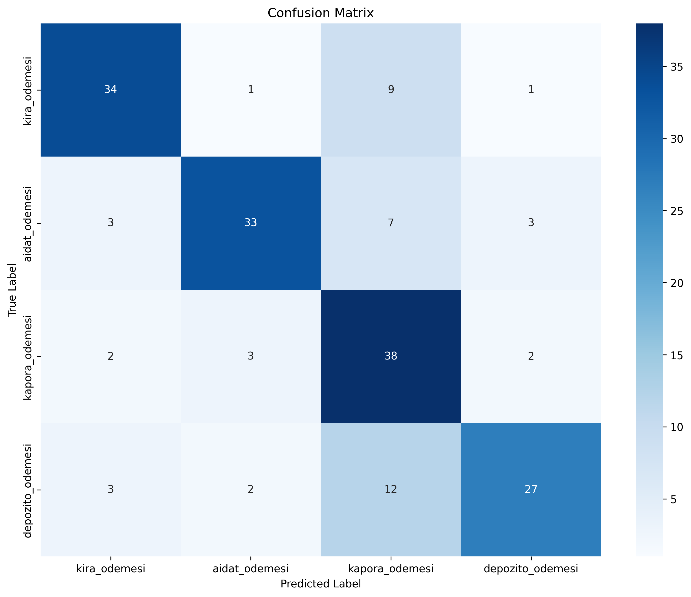

# Akıllı Emlak Ödeme Yönetim Sistemi

**OCR + NLP + AI Chatbot + Dashboard** - Tam Entegre Dekont İşleme Sistemi

---

## Proje Özeti

Emlak sektörü için tam otomatik dekont işleme sistemi. PDF dekontları yükleyin, sistem otomatik olarak:
- OCR ile metin çıkarır (4 banka desteği)
- Ödeme tipini belirler (Intent Classification)
- Önemli bilgileri çıkarır (NER)
- Veritabanı ile eşleştirir (Fuzzy Matching)
- AI ile konuşarak sorgu yaparsınız
- Web dashboard'da sonuçları görürsünüz

### Tamamlanan Özellikler

**7 Ana Modül:**
- OCR Extraction - 4 banka desteği (Ziraat, Halkbank, Yapı Kredi, Kuveyt Türk)
- Intent Classification - DistilBERT-based, v4 Production
- Named Entity Recognition - Hybrid BERT+Regex, v4 Production
- Full Pipeline - PDF → JSON tek komutla
- Receipt Matching - Fuzzy matching, confidence-based scoring
- Rule-based Chatbot - Template-based + NLP entegrasyonu
- Streamlit Dashboard - Modern web UI + PDF upload + AI chat

---

## Performans Metrikleri

### Intent Classification (v4 Production)

**Test Sonuçları:**
- Test Accuracy: 73.33%
- F1-Score: 73.60%
- Gerçek Dekont: 95.74% confidence (keyword boosting ile)
- Dataset: 1200 samples (300 her kategori)
- Eğitim Süresi: ~1.5 dakika

**Kategori Bazlı Sonuçlar:**
- kira_odemesi: F1 78.16%
- aidat_odemesi: F1 77.65%
- kapora_odemesi: F1 68.47%
- depozito_odemesi: F1 70.13%

**Confusion Matrix:**


**Özellikler:**
- Multi-month payment desteği (kasım aralık ocak)
- OCR error correction (I→1, O→0)
- Keyword-based confidence boosting
- Context-based inference (apartmanı + ay → kira)

### Named Entity Recognition (v4 Production)

**Test Sonuçları:**
- Test Accuracy: 99.25%
- F1-Score: 99.28%
- Precision: 98.71%
- Recall: 99.85%
- Dataset: 3600 samples
- Eğitim Süresi: ~6.5 dakika

**Entity Bazlı Sonuçlar:**
- AMOUNT: 100% F1
- BANK: 100% F1
- DATE: 100% F1
- PERIOD: 100% F1 (multi-month support)
- RECEIVER: 100% F1
- RECEIVER_IBAN: 100% F1
- SENDER: 99.81% F1
- SENDER_IBAN: 100% F1
- TRANSACTION_TYPE: 100% F1
- APT_NO: 98.92% F1
- TITLE: 90.00% F1 (yeni entity)

**Özellikler:**
- REGEX-first hybrid extraction (confidence-based)
- TITLE entity (mülk/apartman adı)
- Multi-month period support
- OCR error correction
- Subword token merging fix

### Receipt Matching

**Gerçek Dekont Test:**
- Match Confidence: 92.86%
- IBAN Match: 100%
- Amount Match: 100%
- Name Match: 100%
- Address Match: 29%
- Sender Match: 100%

**Kriterler:**
- IBAN: 35% ağırlık
- Amount: 30% ağırlık
- Name: 20% ağırlık
- Address: 10% ağırlık
- Sender: 5% ağırlık
- Toplam: 100%

---

## Hızlı Başlangıç

### 1. Kurulum

```bash
# Repo'yu klonla
git clone https://github.com/Furkanturan8/rent-receipt-matcher
cd nlp-project

# Virtual environment oluştur ve aktif et
python -m venv .venv
source .venv/bin/activate  # Windows: .venv\Scripts\activate

# Bağımlılıkları yükle
pip install -r requirements.txt
```

### 2. Model Eğitimi

**V4 Production Modelleri:**

```bash
# Intent Classification model eğit (~1.5 dakika)
python src/nlp/v4/train_intent_classifier.py

# NER model eğit (~6.5 dakika)
python src/nlp/v4/train_ner.py

# Modeller models/v4_production/ klasörüne kaydedilir
```

**Not:** Eğitilmiş modeller olmadan sadece OCR çalışır. NLP özellikleri için model eğitimi gerekli.

### 3. Pipeline Kullanımı

```bash
# PDF işle (otomatik banka tespiti)
python src/pipeline/cli.py --pdf data/ziraatbank2.pdf --bank ziraatbank --pretty

# Matching ile
python src/pipeline/cli.py --pdf data/ziraatbank2.pdf --enable-matching --pretty

# OCR JSON'dan
python src/pipeline/cli.py --ocr-json results/ocr_output.json --pretty
```

### 4. Dashboard

```bash
# Streamlit dashboard (Web UI)
streamlit run src/dashboard/app.py

# Tarayıcıda otomatik açılır: http://localhost:8501
```

### 5. Python API

```python
# Full Pipeline
from src.pipeline.full_pipeline import ReceiptPipeline

pipeline = ReceiptPipeline(enable_matching=True)
result = pipeline.process_from_file("data/v4_production/ner_v4.json")  # Dataset örneği
print(result['summary'])
# Örnek: "Kira Ödemesi | Gönderen: ALI ÇELIK | Alıcı: Emlak Ofisi | Tutar: 31000.00 TRY | Mülk: Çiçek2 | Daire: A2 | Dönem: Şubat"

print(result['matching']['confidence'])
# Örnek: 87.5

# Chatbot
from src.chatbot import RealEstateChatbot

chatbot = RealEstateChatbot()
response = chatbot.handle_message("Ali Çelik kimdir?")
print(response)
# Örnek: Kiracı bilgileri ve ödeme geçmişi
```

---

## Proje Yapısı

```
nlp-project/
├── src/
│   ├── ocr/                          # OCR & Extraction
│   │   ├── extraction/               # Bank detection, regex patterns
│   │   └── matching/                 # Fuzzy matching, normalizers
│   ├── nlp/                          # NLP Models
│   │   ├── v1/                       # İlk versiyon (synthetic)
│   │   ├── v2/                       # OCR-aware versiyon
│   │   ├── v3/                       # Robust versiyon
│   │   └── v4/                       # Production versiyon (CURRENT)
│   │       ├── inference_v4.py      # V4 inference (confidence-based)
│   │       ├── train_intent_classifier.py
│   │       └── train_ner.py
│   ├── pipeline/                     # Full Pipeline
│   │   ├── full_pipeline.py          # Ana pipeline (V4 entegre)
│   │   └── cli.py                    # Komut satırı arayüzü
│   ├── chatbot/                      # AI Chatbot
│   ├── dashboard/                    # Web Dashboard
│   └── backend-simulation/           # Backend servisleri
│
├── data/
│   ├── v1_synthetic/                 # Synthetic data
│   ├── v2_ocr_aware/                 # OCR-aware data
│   ├── v3_robust/                    # Robust data
│   └── v4_production/                # Production data (CURRENT)
│       ├── intent_v4.json (1200 samples)
│       └── ner_v4.json (3600 samples)
│
├── models/
│   └── v4_production/                # Production modelleri (CURRENT)
│       ├── intent_classifier/final/
│       └── ner/final/
│
├── tests/
│   ├── mock-data.json                # Mock database
│   └── test_receipt_*.json           # Test case'ler
│
├── docs/                             # Dokümantasyon
├── scripts/                          # Data generation
├── requirements.txt
└── README.md
```

---

## Teknoloji Stack

### NLP & ML
- Model: DistilBERT-base-turkish-cased (Hugging Face)
- Framework: PyTorch 2.9+, Transformers 4.57+
- Training: 4800+ samples (1200 intent + 3600 NER)
- Inference: Hybrid (REGEX-first + BERT fallback) with confidence-based selection

### OCR & Processing
- OCR: Tesseract 4.x
- Image Processing: şu an yok!!!
- Logo Detection: şu an eklenmedi..
- Fuzzy Matching: Levenshtein distance, Jaccard similarity

### Web & UI
- Dashboard: Streamlit 1.28+
- Visualization: Plotly

### Database & Matching
- Mock DB: JSON-based (tests/mock-data.json)
- Matching: Multi-criteria fuzzy matching (confidence-based)
- Normalization: OCR error correction, Turkish chars

---

## V4 Production Özellikleri

### Yeni Entity'ler
- TITLE: Mülk/apartman adı (çalık-2, ada-3) - 90% F1
- FEE entity kaldırıldı (gereksiz)

### Multi-Month Support
- Tek aylık ödeme: %70 dataset
- İki aylık ödeme: %20 dataset
- Üç aylık ödeme: %10 dataset
- Örnek: "kasım aralık ocak 24bin tl"

### OCR Error Correction
- Runtime düzeltme: I→1, O→0, l→1
- Örnek: "I4O TL" → "140 TL"
- Örnek: "No:I4" → "No:14"

### Confidence-Based Selection
- REGEX ve BERT confidence karşılaştırması
- Yüksek confidence'a sahip olan seçilir
- REGEX: 0.9-1.0 confidence (structured patterns)
- BERT: 0.08-0.95 confidence (context-dependent)

### Keyword & Context Boosting
- Keyword-based confidence boosting (kira, aidat keywords)
- Context-based inference (apartmanı + ay → kira)
- Confidence cap: 1.0 (max)

---

## Dokümantasyon

### Ana Dokümanlar
- README.md - Bu dosya
- rapor.md - Detaylı teknik rapor (v4 sonuçları)
- PROJECT_STATUS.md - Proje durum raporu

### Modül Dokümantasyonu
- src/pipeline/README.md - Pipeline rehberi
- src/nlp/README.md - NLP modelleri rehberi

### Teknik Dokümanlar
- docs/ - Tüm teknik dokümanlar
- docs/reports/ - Detaylı raporlar

---

## Kapsam
- Dataset: 4800+ örnek (v4 production)
- Model: Türkçe DistilBERT fine-tuning
- Pipeline: OCR → Intent → NER → Matching → Dashboard
- Metrikler: %99.28 NER F1, %73.33 Intent accuracy (test), %95.74 gerçek dekont

---

## Versiyon Geçmişi

### v4 Production (Current)
- TITLE entity eklendi
- Multi-month payment desteği
- OCR error correction
- Confidence-based selection
- Keyword & context boosting
- REGEX-first hybrid extraction

### v3 Robust
- Hybrid BERT + Regex
- Noise injection
- 99.81% NER F1
- 96.67% Intent accuracy

### v2 OCR-Aware
- OCR formatları eklendi
- 11 entity types

### v1 Synthetic
- Baseline model
- 6 entity types

---

## Lisans

MIT License

---

**Son Güncelleme:** 17 Aralık 2024  
**Versiyon:** v4 Production
